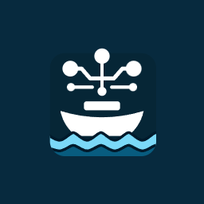
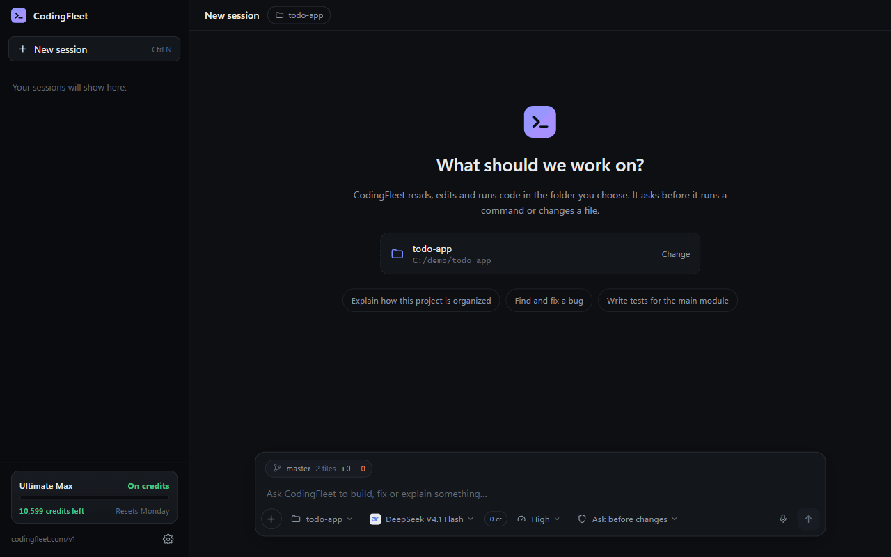

<div align="center">



# CodingFleet Desktop

**An AI coding agent that works on your real code, on your computer, and asks before it changes anything.**

[](https://github.com/x4nth055/codingfleet-desktop/releases/latest)
[](https://github.com/x4nth055/codingfleet-desktop/releases)
[](#download)
[](LICENSE)

[**Download**](#download) · [Features](#features) · [Tools](#tools) · [Build it yourself](#build-it-yourself) · [codingfleet.com](https://codingfleet.com)



<sub>A real run, sped up a little: the agent reads the project, asks before it runs a command or edits a file, then shows what it changed.</sub>

</div>

---

## Download

| | System | File |
|---|---|---|
| 🪟 | **Windows** 10 / 11 | [`CodingFleet-Setup-<version>.exe`](https://github.com/x4nth055/codingfleet-desktop/releases/latest) |
| 🍎 | **macOS** (Apple silicon / Intel) | [`CodingFleet-<version>-arm64.dmg` / `-x64.dmg`](https://github.com/x4nth055/codingfleet-desktop/releases/latest) |
| 🐧 | **Linux** | [`.AppImage` or `.deb`](https://github.com/x4nth055/codingfleet-desktop/releases/latest) |

Open the app, click **Sign in with your browser**, and approve. That's all.

> **Windows:** until code signing is in place, Windows may say "Windows protected your PC".
> Click **More info → Run anyway**.
>
> **macOS:** the app is not signed by Apple. The first time, open it from
> **System Settings → Privacy & Security → Open Anyway**.

---

## Features

| | |
|---|---|
| 🧑‍💻 **Works on your real code** | Reads, edits and runs things in the folder you pick. |
| 🛡️ **You stay in control** | Every command and every file change waits for your OK. |
| ↩️ **Undo** | Puts back every file a run changed, in one click. |
| 🧭 **Steer a run** | Send a correction while the agent works. |
| ☁️ **Cloud sandbox** | Or let the agent work on CodingFleet's servers instead of your PC. |
| 🔌 **MCP** | 13 built-in connectors (GitHub, Context7, Stripe, Sentry…) and your own local MCP servers. |
| 🖼️ **Images and voice** | Paste images, take screenshots, speak your prompt. |
| 💳 **Cost before you send** | An estimate next to the Send button. |
| 🎨 **Three themes** | Dark, Light and Hacker. |

## Tools

What the agent can use on your computer:

| Tool | What it does |
|---|---|
| `fs_read` | Read a file |
| `fs_glob` | Find files by name |
| `fs_write` | Write a file |
| `fs_edit` | Change part of a file |
| `run_command` | Run a shell command (also in the background, for dev servers) |
| `execute_code` | Run a piece of code |
| `read_background` / `stop_background` | Read or stop a background command |
| `view_image` | Look at an image in your folder |
| `take_screenshot` | Take a picture of your screen (always asks first) |

It also has CodingFleet's server tools, such as web search and image generation, if you turn
them on.

---

## Where the tools run

Each session picks one place when you start it:

| | Your folder | Cloud sandbox |
|---|---|---|
| Tools run on | your computer | CodingFleet's servers |
| Sees your code | yes, in that folder | only what you upload |
| Asks before changes | yes | no (nothing local to protect) |
| Local MCP servers | yes | no |

Pick a folder to work on real code. Pick no folder for a safe, empty sandbox.

## Approvals

| What the agent does | What happens |
|---|---|
| Reads files inside the folder | Runs at once |
| Reads outside the folder | Asks |
| Runs a command or changes files | Asks |
| Reads `.env`, keys or passwords | Asks, **even in Auto-approve** |
| Deletes a lot, rewrites git history, wipes data | Asks **every time** |
| Runs a script downloaded from the internet | Asks **every time** |

These checks catch mistakes. They are not a sandbox.

### Background commands

Dev servers and watchers keep running in the background. A bar above the prompt shows them,
with a Stop button each.

### Ask before changes, or Auto-approve

Switch with the shield button.

- **Ask before changes** (default): you answer **Allow**, **Deny** or **Allow all this
  session**. "Allow all" allows that *kind* of action, for example every command.
- **Auto-approve**: only the protected actions above still ask. Use it only in a folder you
  can afford to lose.

### Undoing a run

**Undo** on the "Edited files" card puts back every file the run changed. Files you changed
yourself afterwards are not touched. Undo keeps the last 20 runs until you close the app. Git
is still your real safety net.

### When the computer sleeps

While a run goes, the app keeps the computer awake. If the computer goes to sleep anyway, the
run stops and is kept: type **continue** to go on. Cloud sandbox runs do not need your
computer.

## Project instructions (`AGENTS.md`)

Put an `AGENTS.md` file in your folder, and the agent follows it:

```markdown
- Run `npm test` before you say a change works.
- Never edit anything under `generated/`.
```

## What a run costs

The estimate next to Send comes from what earlier runs cost. Above 100 credits, the app asks
first and suggests cheaper models.

---

## Run it from the source code

You need **Node.js 22 or newer**.

```bash
git clone https://github.com/x4nth055/codingfleet-desktop.git
cd codingfleet-desktop
npm install
npm start
```

Sign in with your browser, or paste an API key from
[codingfleet.com/agent-api](https://codingfleet.com/agent-api). The key is encrypted by your
system (Windows DPAPI, macOS Keychain, Linux libsecret/kwallet).

**Windows users: install [Git for Windows](https://git-scm.com/download/win).** The agent
writes better Bash than PowerShell. Without Git, it uses PowerShell.

### Tests

```bash
npm test                 # unit tests
npm run test:layout      # layout checks
npm run e2e              # a real run on codingfleet.com (needs CODINGFLEET_API_KEY)
```

## Build it yourself

```bash
npm run dist          # Windows installer
npm run dist:mac      # macOS (needs a Mac)
npm run dist:linux    # Linux (needs Linux)
```

The files go to `dist/`. Close the app before you build.

## How it fits together

```
src/core/       the agent logic, no Electron (tools, approvals, runs, MCP, undo)
src/main/       the Electron main process (window, keys, updates, crashes)
src/renderer/   the window (it never sees your API key)
test/           tests
```

## Logs and crash reports

The app writes a log in its data folder (Preferences → Diagnostics). The log never contains
your messages, files or keys. After a crash, the app asks if you want to send a report.
Nothing is sent without your OK.

## Releasing

Change `version` in `package.json`, commit, and push a tag:

```bash
git tag v1.0.0
git push origin v1.0.0
```

GitHub Actions builds Windows, macOS and Linux and publishes a release. The app gets its
updates from these releases.

### Code signing

- **Windows:** signed for free by SignPath Foundation (see `.signpath/`).
- **macOS:** not signed by Apple, so the app cannot update itself. It tells you when a new
  version is out.
- **Linux:** no signing needed.

---

## Code signing policy

Free code signing provided by [SignPath.io](https://signpath.io), certificate by
[SignPath Foundation](https://signpath.org).

- Committers and reviewers: [@x4nth055](https://github.com/x4nth055)
- Approvers: [@x4nth055](https://github.com/x4nth055)

Every signed file is built from this repository by GitHub Actions, and each release is
approved before it is signed.

## Privacy

This program will not transfer any information to other networked systems unless specifically
requested by the user or the person installing or operating it.

In practice:

- It talks to CodingFleet only after you sign in, to do what you ask. See the
  [CodingFleet privacy policy](https://codingfleet.com/privacy-policy).
- It checks for updates only if you said yes.
- It sends a crash report only if you click **Send report**.
- Images from other websites load only when you click them.
- It connects to an MCP server only if you added it.

## License

[MIT](LICENSE)
